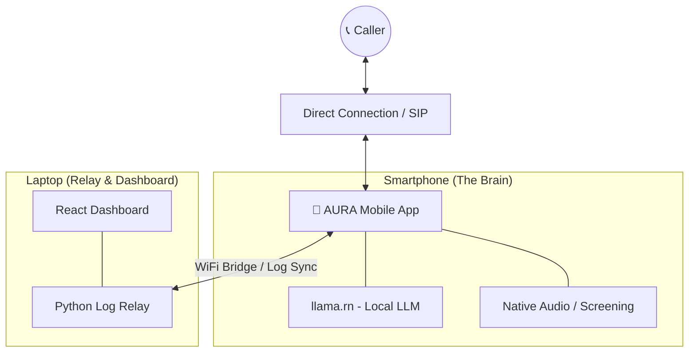

# 🦾 AURA: Mobile-First AI Personal Assistant

AURA (Advanced Universal Real-time Assistant) is a state-of-the-art, 100% private, and local-first AI phone agent. Unlike traditional systems, AURA places the "Brain" directly on your smartphone, ensuring your data never leaves your hand.

---

## 🌟 Key Features

*   **Mobile-First Intelligence**: Core AI inference and call logic run natively on your Android or iOS device using `llama.rn`.
*   **Smart Call Screening**: AURA catches incoming calls and asks if you want to answer or if the AI should handle it.
*   **$0 Operating Cost**: No API subscriptions (OpenAI, ElevenLabs) required.
*   **Hybrid Intelligence**: Seamlessly offload heavy reasoning tasks to your laptop bridge when connected to Wi-Fi for ultra-fast response times.
*   **Privacy-First**: Audio and transcripts are processed on-device; the laptop only acts as a monitoring relay.
*   **Voice Cloning**: Speak to callers in your own voice using Coqui XTTS-v2 cloning technology.
*   **Real-Time Telephony**: Standard SIP integration works natively for inbound and outbound calls.

---

## 🏗️ System Architecture

AURA is decentralized. Your phone handles the "Thinking," while your laptop provides "Monitoring."

---

## 📁 Repository Structure

*   [**`/mobile-app`**](./mobile-app): The primary AURA application. Built with React Native/Expo.
*   [**`/ai-brain`**](./ai-brain): The laptop bridge and log relay server (Python/FastAPI).
*   [**`/frontend`**](./frontend): The monitoring dashboard for live activity streams (React).
*   [**`/phone-system`**](./phone-system): Optional Node.js SIP handler for legacy laptop-based testing.
*   [**`/voice-clone`**](./voice-clone): Tools for creating personal voice clone samples.

---

## 🚀 Getting Started

### 1. Mobile App Setup (The Brain)
The AURA mobile app allows you to take your AI agent anywhere.
1.  **Build the App**: Follow the [Mobile Tutorial](./mobile-app/tutorial.md) to build and install the app on your device.
2.  **Download Models**: Use the **Models** tab in the app to download a small LLM (like Qwen 0.5B) for on-device processing.

### 2. Laptop Setup (The Monitor)
To view live logs and activity on your web browser:
1.  **Prerequisites**: Python 3.10+, Node.js 18+.
2.  **Launch Dashboard**: Open PowerShell and run `./start.ps1`.
3.  **Sync**: Connect your phone to your laptop's IP in the AURA App **Settings** tab.

---

## ⚙️ Configuration (.env)

| Variable              | Description                               | Default                    |
| :-------------------- | :---------------------------------------- | :------------------------- |
| `OWNER_NAME`          | The name the AI uses to refer to you.      | `User`                     |
| `MOBILE_BRIDGE_PORT`  | Port used for syncing mobile logs to web. | `8000`                     |
| `TTS_ENGINE`          | `native` (on phone) or `coqui` (cloned).   | `native`                   |
| `VOICE_SAMPLE_PATH`   | Path to your voice clone `.wav` file.     | `./voice-clone/sample.wav` |

---

## 📜 License

MIT License - See [LICENSE](./LICENSE) for details.
