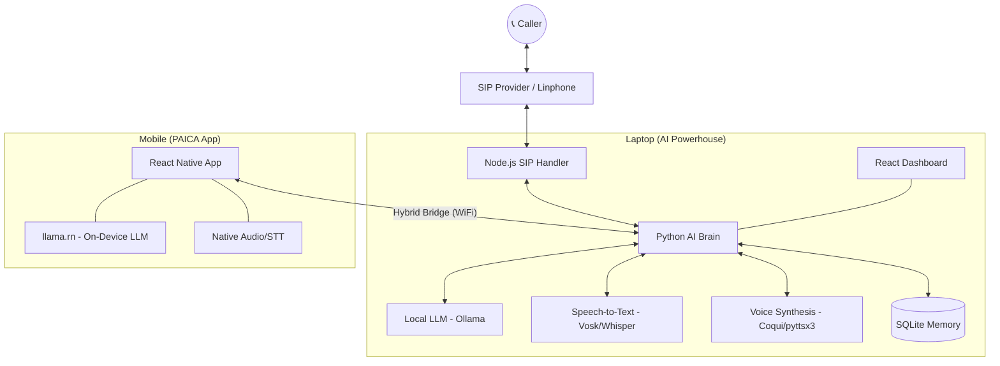

# 🦾 AI Agent: PAICA (Personal AI Communication Agent)

A state-of-the-art, 100% private, and local-first AI phone agent. It handles calls via SIP, processes speech using local LLMs, and responds with natural or cloned voices. Built for users who demand privacy and total control over their communication.

---

## 🌟 Key Features

*   **$0 Operating Cost**: No API subscriptions (OpenAI, ElevenLabs, Twilio) required.
*   **Privacy-First**: No audio or transcripts ever leave your local network.
*   **Hybrid Intelligence**: Seamlessly offload heavy AI processing from your smartphone to your laptop for ultra-fast response times.
*   **On-Device AI**: Run LLMs directly on your phone using `llama.rn` when away from your laptop.
*   **Voice Cloning**: Speak to callers in your own voice using Coqui XTTS-v2 cloning technology.
*   **Real-Time Telephony**: Standard SIP integration works with Linphone, VoIP.ms, and other providers.

---

## 🏗️ System Architecture



---

## 📁 Repository Structure

*   [**`/ai-brain`**](file:///c:/projects/AI-CALL_AGENT/ai-brain): The core Python logic. Manages LLM orchestration, memory, and speech processing.
*   [**`/mobile-app`**](file:///c:/projects/AI-CALL_AGENT/mobile-app): React Native (Expo) application for Android and iOS. Supports local inference.
*   [**`/phone-system`**](file:///c:/projects/AI-CALL_AGENT/phone-system): Node.js service managing SIP registration and real-time audio streaming.
*   [**`/frontend`**](file:///c:/projects/AI-CALL_AGENT/frontend): A Vite + React dashboard to monitor agent activity and call logs in real-time.
*   [**`/voice-clone`**](file:///c:/projects/AI-CALL_AGENT/voice-clone): Guide and directory for creating your personal voice clone samples.

---

## 🚀 Quick Start (Laptop)

### 1. Prerequisites
- **Python 3.10+**
- **Node.js 18+**
- **[Ollama](https://ollama.com/)** (Downloaded and running with `llama3` or `mistral`)

### 2. Launch Everything
The project includes a master orchestration script. Simply open PowerShell and run:
```powershell
./start.ps1
```
This script will:
1. Initialize the Python virtual environment.
2. Start the AI Brain (FastAPI).
3. Start the SIP Handler (Node.js).
4. Launch the Web Dashboard.

---

## 📱 Mobile App Setup

The PAICA mobile app allows you to take your AI agent anywhere.

1.  **Build the App**: Follow the [Mobile Tutorial](file:///c:/projects/AI-CALL_AGENT/mobile-app/tutorial.md) to build and install the app on your device.
2.  **Download Models**: Use the **Models** tab in the app to download a small LLM (like Qwen 0.5B) for on-device processing.
3.  **Bridge Connection**: Connect to your laptop's IP in the **Settings** tab to enable **Hybrid Mode** for faster, smarter responses.

---

## ⚙️ Configuration (.env)

| Variable | Description | Default |
| :--- | :--- | :--- |
| `OWNER_NAME` | The name the AI uses to refer to you. | `User` |
| `STT_ENGINE` | `vosk` (fast) or `whisper` (accurate). | `vosk` |
| `TTS_ENGINE` | `pyttsx3` (basic) or `coqui` (cloned). | `pyttsx3` |
| `VOICE_SAMPLE_PATH` | Path to your voice clone `.wav` file. | `./voice-clone/sample.wav` |
| `SIP_URI` | Your SIP account address (for real calls). | `sip:user@domain.com` |

---

## 🤝 Contributing

Contributions are welcome! Please feel free to submit a Pull Request.

---

## 📜 License

MIT License - See [LICENSE](file:///c:/projects/AI-CALL_AGENT/LICENSE) for details. (Coming soon)

